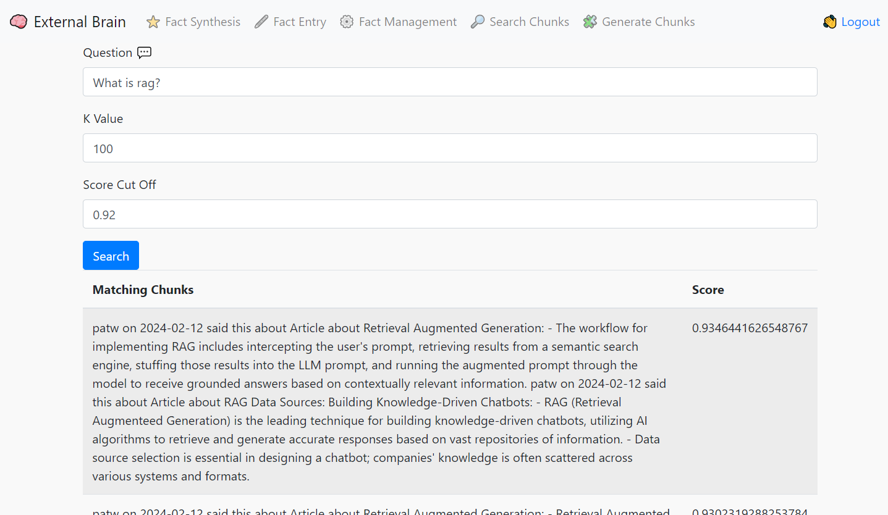

# External Brain

Facts are all you need (tm) ... and maybe an LLM, a text embedder, mongo and some python!

External Brain is a tool for asserting facts or writing down your thoughts, storing them in a durable data store and giving you the ability to ask an LLM questions about them later.

* Use the input tool to summarize whatever text you send it.  It will use the LLM to produce bullet point facts for all your data
* Facts get grouped into fact chunks and vectorized by a text embedder
* Questions to the External Brain will retrieve facts before answering, grouding the response with your own facts!




## Local Installation

```
pip install -r requirements.txt
```

Rename the mode.json.sample to model.json.  This file is used to set the prompt format and ban tokens, the default is ChatML format so it should work with most recent models.  Set the llama_endpoint to point to your llama.cpp running in server mode.

## Setting up Vector Search Indexes

Add the following index definition to the ```chunks``` collection

```
{
  "analyzer": "lucene.english",
  "mappings": {
    "dynamic": false,
    "fields": {
      "fact_chunk": {
        "type": "string"
      },
      "chunk_embedding": [
        {
          "type": "knnVector",
          "dimensions": 768,
          "similarity": "cosine"
        }      
      ]    
    } 
  }
}
```

Add the following index definition to the ```facts``` collection

```
{
  "mappings": {
    "dynamic": false,
    "fields": {
      "context": {
        "type": "string"
      },
      "fact": {
        "type": "string"
      }
    }
  },
  "analyzer": "lucene.english"
}
```

## Setting up the Text Embedder

I built this app using https://github.com/patw/InstructorVec however you could modify the source to use Mistral.ai or OpenAI embedding.  Be sure to modify the vector search indexes to use the proper number of dimensions.  

## Downloading an LLM model

We highly recommend OpenHermes 2.5 Mistral-7b fine tune for this task, as it's currently the best (Nov 2023) that
we've tested personally.  You can find different quantized versions of the model here:

https://huggingface.co/TheBloke/OpenHermes-2.5-Mistral-7B-GGUF/tree/main

I'd suggest the Q6 quant for GPU and Q4_K_M for CPU

## Running a model on llama.cpp in API mode

### Windows

Go to the llama.cpp releases and download either the win-avx2 package for CPU or the cublas for nvidia cards:

https://github.com/ggerganov/llama.cpp/releases

Extract the files out and run the following for nvidia GPUs:
```
server.exe -m <model>.gguf -t 4 -c 2048 -ngl 33 --host 0.0.0.0 --port 8086
```

For CPU only:
```
server.exe -m <model>.gguf -c 2048 --host 0.0.0.0 --port 8086
```

Replace <model> with whatever model you downloaded and put into the llama.cpp directory

### Linux, MacOS or WSL2
 
Follow the install instructions for llama.cpp at https://github.com/ggerganov/llama.cpp

Git clone, compile and run the following for GPU:
```
./server -m models/<model>.gguf -t 4 -c 2048 -ngl 33 --host 0.0.0.0 --port 8086
```

For CPU only:
```
./server -m models/<model>.gguf -c 2048 --host 0.0.0.0 --port 8086
```

Replace <model> with whatever model you downloaded and put into the llama.cpp/models directory

## Config files

Copy embedder.json.sample to embedder.json and point it to the endpoint for your embedding service (recommend using https://github.com/patw/InstructorVec for least effort)

Copy the model.json.sample to model.json and point it to your llama.cpp running in server mode (see above!)


